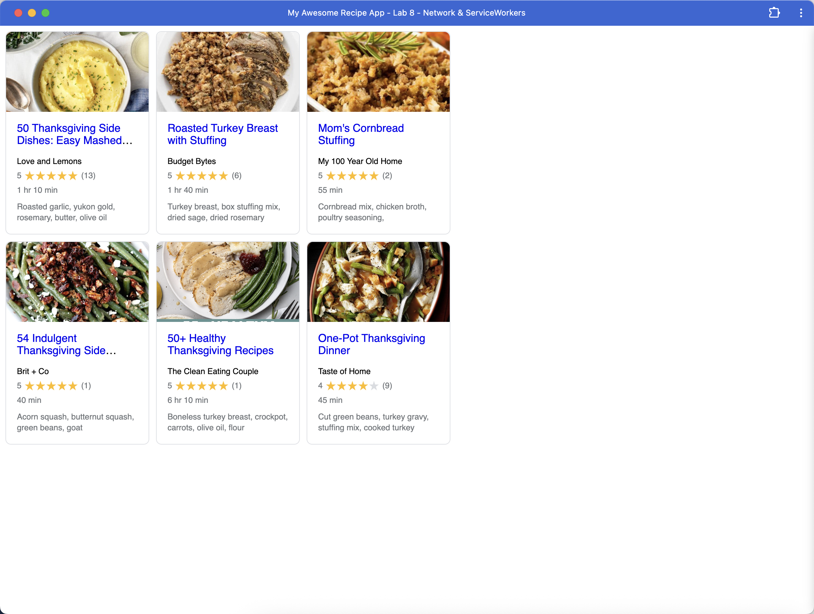

# Lab8-Starter

https://chencheng-li.github.io/Lab8_Starter/

Question Answers:
Graceful degradation, in the context of Service Workers, means that our web application first checks if the user's browser supports the Service Worker API.
If it is **supported**, the Service Worker is registered, providing an enhanced experience such as offline capabilities and faster load times due to caching.
If Service Workers are **not supported**, the application does not attempt to register one and **gracefully degrades** by continuing to function using standard network requests. The website **remains usable**, though without the offline and caching benefits provided by the Service Worker. This ensures that users with older browsers or unsupported environments can still access the core content and functionality of the site.

